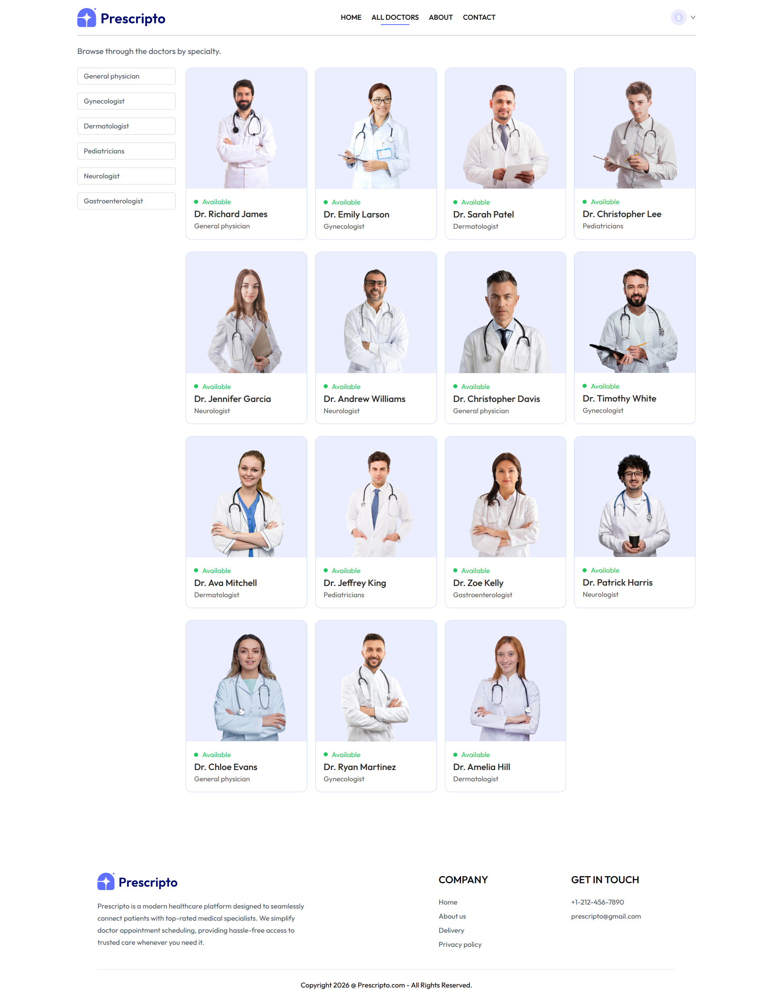
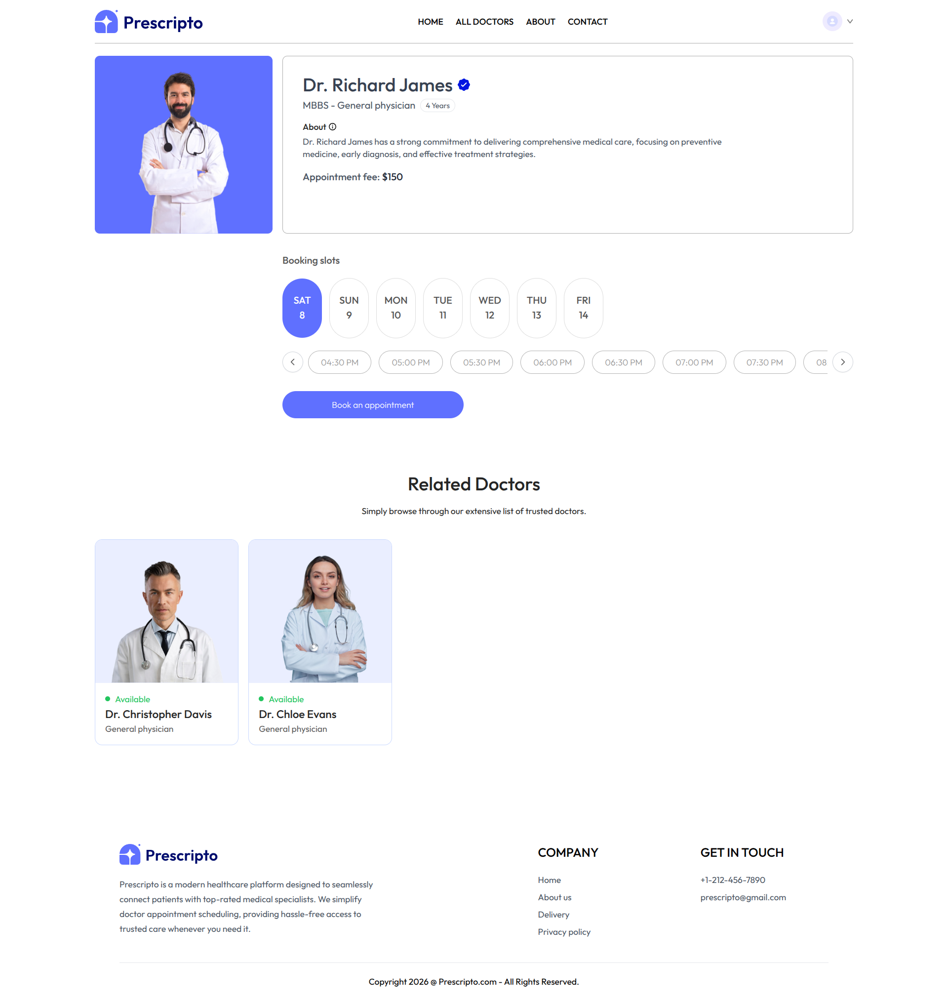
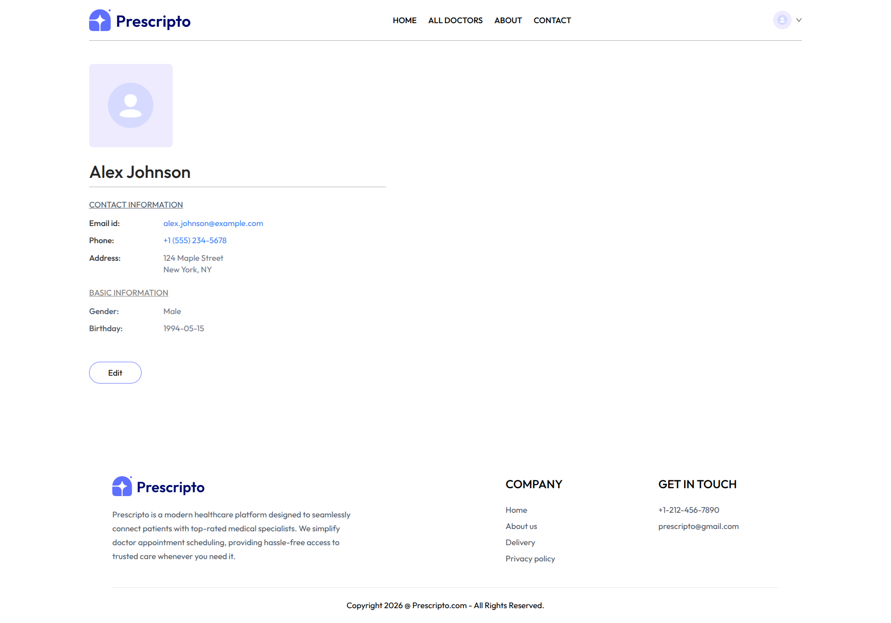
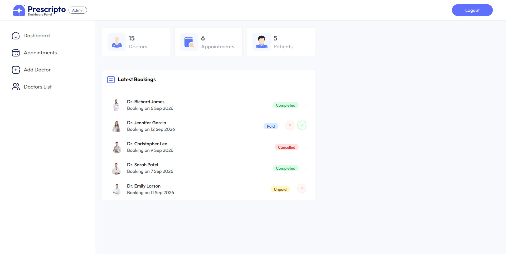
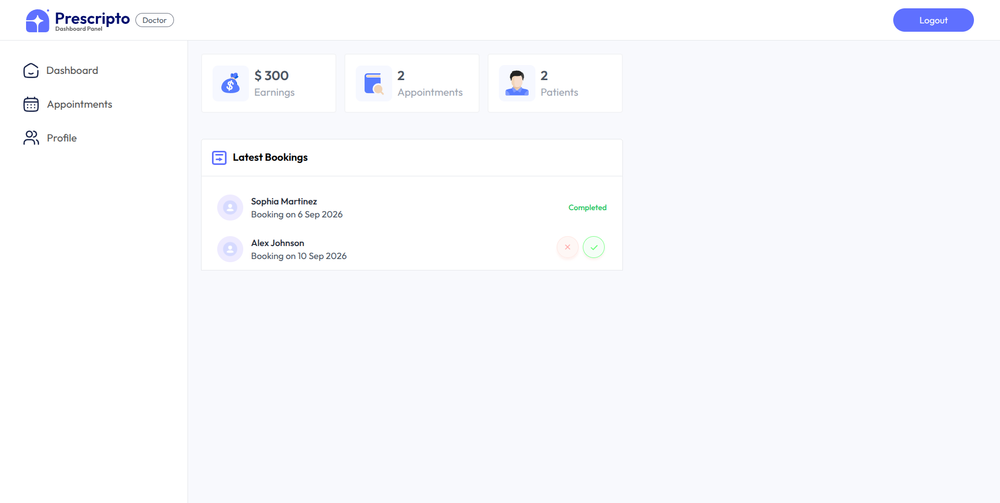

## 🩺 Prescripto — Full Stack Doctor Appointment Booking Platform

Prescripto is a modern full-stack healthcare scheduling platform designed to seamlessly connect patients with top-rated medical specialists. It eliminates the friction of traditional appointment booking by offering real-time doctor availability tracking, interactive slot selection, multi-currency fee localization in USD ($), online Stripe payment processing, and dedicated management portals for both Super Admins and Healthcare Practitioners.

## 🌐 Live Demo

🔗 [View Prescripto Live](https://prescripto-full-stack-sigma.vercel.app/)

## 👀 Previews

### 🏠 Home Page


### 👨‍⚕️ All Doctors & Specialty Filtering


### 📅 Doctor Appointment & Slot Booking


### 👤 User Profile & My Appointments Portal


### 🛡️ Admin Control Panel


### 🩺 Doctor Portal Dashboard


## ✨ Features

### 🛍️ Patient Experience
- **Responsive Layout & Design System**: Custom responsive UI built with Tailwind CSS and Vanilla CSS, featuring dynamic header banners, specialty filtering menus, smooth scroll controls, and mobile navigation overlays.
- **Specialty Filtering & Search**: Filter doctors by medical domain including *General physician*, *Gynecologist*, *Dermatologist*, *Pediatricians*, *Neurologist*, and *Gastroenterologist*.
- **Interactive Appointment Booking**: Real-time 7-day slot generator with formatted 12-hour AM/PM time slots and horizontal scroll controls for selecting convenient consultation times.
- **Online Stripe Payment Gateway**: Integrated Stripe checkout session generation allowing patients to pay consultation fees securely in USD ($).
- **Patient Dashboard & Profile**: Personal account manager supporting Cloudinary avatar photo uploads, address updates, phone verification, and appointment tracking with live status indicators (**Paid**, **Unpaid**, **Completed**, **Cancelled**).

### 🔐 Authentication & Multi-Role Security
- **Patient Authentication**: Dedicated Sign Up (`/signup`) and Login (`/login`) pages backed by JWT token issuance and `bcryptjs` password hashing.
- **Admin & Doctor Portal Auth**: Unified multi-role login portal (`/admin`) with one-click toggle between Super Admin and Doctor access modes.

### 🛡️ Super Admin Control Panel
- **Real-Time System Analytics**: Dashboard reporting total store revenue, registered doctor count, patient metrics, and recent appointment activity logs.
- **Doctor Onboarding & Management**: Form interface to register new doctors with Cloudinary photo uploads, qualifications, experience, custom fees, clinic addresses, and bio details.
- **Global Appointment Management**: Complete list of patient bookings with status badges and one-click action triggers to mark appointments as **Completed (`✓`)** or **Cancelled (`X`)**.
- **Real-Time Doctor Availability Toggle**: One-click switch to toggle doctor availability on the public catalog.

### 🩺 Healthcare Practitioner (Doctor) Portal
- **Doctor Analytics Dashboard**: Individual metrics overview displaying doctor earnings, total completed appointments, patient count, and recent consultation requests.
- **Appointment Management**: View assigned patient appointments, complete consultation sessions, or cancel bookings when necessary.
- **Doctor Profile Controls**: Edit consultation fees ($), update clinic addresses, and manage active status.

## 🛠️ Tech Stack

### Frontend (Patient SPA & Admin/Doctor Portal)
| Technology | Purpose |
|------------|---------|
| **React 18 / 19** | Core SPA framework for Patient frontend and Admin/Doctor portals |
| **Vite** | High-performance build tool and development server |
| **Tailwind CSS & Vanilla CSS** | Responsive styling, grid systems, and transition animations |
| **React Router DOM v6** | Client-side routing with sub-application base paths (`/admin`) |
| **Axios** | Promised-based HTTP client for API communications |
| **React Toastify** | Real-time notification toasts for actions, errors, and alerts |

### Backend (Server)
| Technology | Purpose |
|------------|---------|
| **Node.js & Express** | RESTful API server routing and serverless function handlers |
| **MongoDB Atlas & Mongoose** | Cloud NoSQL database engine and object data modeling |
| **JWT (jsonwebtoken)** | Stateless token-based user, doctor, and admin authentication |
| **bcryptjs** | Pure JavaScript password hashing compatible with serverless environments |
| **Stripe SDK** | Secure online credit card session creation and verification |
| **Cloudinary SDK** | Cloud image storage for doctor avatars and patient profile pictures |
| **Multer** | Multipart form-data handling for file uploads |

### Infrastructure & Deployment
| Technology | Purpose |
|------------|---------|
| **Vercel** | Unified hosting for Client SPA, Admin SPA, and Serverless API functions |
| **MongoDB Atlas** | Fully managed cloud database cluster |

## 📁 Project Structure

```
prescripto-full-stack/
├── admin/                   # Vite + React Admin & Doctor Portal frontend
│   ├── public/              # Static public assets
│   ├── src/                 # React source code
│   │   ├── assets/          # Admin icons and logos
│   │   ├── components/      # Shared Navbar and Sidebar components
│   │   ├── context/         # AdminContext, DoctorContext, AppContext
│   │   ├── pages/           # Admin & Doctor views (Dashboard, Appointments, AddDoctor, DoctorsList, Profile)
│   │   ├── App.jsx          # Admin router & token layout
│   │   └── main.jsx         # Entry point configured with /admin basename
│   ├── package.json         # Admin dependencies & scripts
│   └── vite.config.js       # Vite parameters
├── backend/                 # Node.js + Express backend API
│   ├── config/              # MongoDB connection & Cloudinary setup
│   ├── controllers/         # Logic handlers (adminController, doctorController, userController)
│   ├── middleware/          # Auth middleware (authAdmin, authDoctor, authUser, multer)
│   ├── models/              # Mongoose Schemas (userModel, doctorModel, appointmentModel)
│   ├── routes/              # Express API endpoint definitions (adminRoute, doctorRoute, userRoute)
│   ├── server.js            # Express server entry point
│   └── package.json         # Server dependencies & scripts
├── frontend/                # Vite + React Patient frontend
│   ├── public/              # Static web assets
│   ├── src/                 # React source code
│   │   ├── assets/          # Doctor images, logos, vector icons
│   │   ├── components/      # UI components (Navbar, Header, SpecialityMenu, TopDoctors, Banner, Footer)
│   │   ├── context/         # AppContext (global state & auth tokens)
│   │   ├── pages/           # Client views (Home, Doctors, Appointment, Login, SignUp, MyAppointments, MyProfile)
│   │   ├── App.jsx          # Patient client route router
│   │   └── main.jsx         # App entry point
│   ├── package.json         # Frontend dependencies
│   └── vite.config.js       # Vite parameters
├── previews/                # Showcase screenshots for documentation
│   ├── admin_dashboard_page.png
│   ├── all_doctors_page.png
│   ├── appointment_page.png
│   ├── doctor_dashboard_page.png
│   ├── home_page.png
│   └── user_profile_page.png
├── vercel.json              # Vercel serverless routing configuration
└── README.md                # Documentation
```

## 🔌 API Endpoints

### Admin Routes (`/api/admin`)
| Method | Endpoint | Description |
|--------|----------|-------------|
| `POST` | `/api/admin/login` | Authenticates admin credentials and returns JWT token |
| `POST` | `/api/admin/add-doctor` | Registers a new doctor with image upload to Cloudinary |
| `GET` | `/api/admin/appointments` | Fetches all patient appointments for admin overview |
| `POST` | `/api/admin/cancel-appointment` | Cancels an active appointment |
| `POST` | `/api/admin/complete-appointment` | Marks an active appointment as completed |
| `GET` | `/api/admin/all-doctors` | Fetches full list of registered doctors |
| `POST` | `/api/admin/change-availability` | Toggles doctor availability status |
| `GET` | `/api/admin/dashboard` | Retrieves aggregate system analytics & recent bookings |

### Doctor Routes (`/api/doctor`)
| Method | Endpoint | Description |
|--------|----------|-------------|
| `POST` | `/api/doctor/login` | Authenticates doctor credentials and returns JWT token |
| `GET` | `/api/doctor/list` | Public API returning list of available doctors |
| `GET` | `/api/doctor/appointments` | Fetches appointments assigned to the logged-in doctor |
| `POST` | `/api/doctor/complete-appointment` | Doctor marks consultation as completed |
| `POST` | `/api/doctor/cancel-appointment` | Doctor cancels consultation |
| `GET` | `/api/doctor/dashboard` | Fetches doctor-specific dashboard statistics |
| `GET` | `/api/doctor/profile` | Fetches doctor profile information |
| `POST` | `/api/doctor/update-profile` | Updates doctor profile data and consultation fees |

### Patient / User Routes (`/api/user`)
| Method | Endpoint | Description |
|--------|----------|-------------|
| `POST` | `/api/user/register` | Registers a new patient account |
| `POST` | `/api/user/login` | Authenticates patient credentials and returns JWT token |
| `GET` | `/api/user/get-profile` | Fetches logged-in patient profile details |
| `POST` | `/api/user/update-profile` | Updates patient profile info & avatar image |
| `POST` | `/api/user/book-appointment` | Reserves a doctor time slot for consultation |
| `GET` | `/api/user/appointments` | Lists all booked appointments for current patient |
| `POST` | `/api/user/cancel-appointment` | Patient cancels an upcoming appointment |
| `POST` | `/api/user/payment-stripe` | Generates Stripe checkout session for appointment fee |
| `POST` | `/api/user/verifyStripe` | Verifies Stripe transaction status & marks appointment paid |

## 🗄️ Database Schema

The database uses MongoDB Atlas managed via Mongoose models.

### `userModel` (Patients)
- `_id` — ObjectId (Primary Key) — Unique user identifier
- `name` — String (Required) — Full name of patient
- `email` — String (Required, Unique) — Login email address
- `password` — String (Required) — Hashed password string
- `image` — String — Avatar photo URL (Cloudinary / default base64)
- `phone` — String — Contact phone number
- `address` — Object (`line1`, `line2`) — Patient residential address
- `gender` — String — Gender selection
- `dob` — String — Date of birth (`YYYY-MM-DD`)

### `doctorModel` (Doctors)
- `_id` — ObjectId (Primary Key) — Unique doctor identifier
- `name` — String (Required) — Doctor full name
- `email` — String (Required, Unique) — Doctor login email
- `password` — String (Required) — Hashed password string
- `image` — String (Required) — Profile photo URL (Cloudinary)
- `speciality` — String (Required) — Medical domain (e.g., Dermatologist, Neurologist)
- `degree` — String (Required) — Medical qualification degree
- `experience` — String (Required) — Practice experience in years
- `about` — String (Required) — Professional biography text
- `available` — Boolean (Default: `true`) — Current availability status
- `fees` — Number (Required) — Consultation fee in USD ($)
- `address` — Object (`line1`, `line2`) — Clinic or hospital location
- `date` — Number (Required) — Registration timestamp
- `slots_booked` — Object — Map of date strings (`D_M_YYYY`) to array of booked time slot strings

### `appointmentModel` (Appointments)
- `_id` — ObjectId (Primary Key) — Unique appointment reference code
- `userId` — String (Required) — Reference to patient user `_id`
- `docId` — String (Required) — Reference to doctor `_id`
- `slotDate` — String (Required) — Consultation date string (`D_M_YYYY`)
- `slotTime` — String (Required) — Consultation time string (e.g., `10:00 AM`)
- `userData` — Object (Required) — Snapshot of patient profile at booking
- `docData` — Object (Required) — Snapshot of doctor profile at booking
- `amount` — Number (Required) — Consultation fee charged in USD ($)
- `date` — Number (Required) — Booking creation timestamp
- `cancelled` — Boolean (Default: `false`) — Cancellation status flag
- `payment` — Boolean (Default: `false`) — Payment completion status flag
- `isCompleted` — Boolean (Default: `false`) — Consultation completion status flag
